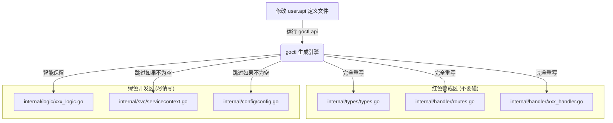

# API 服务开发指南

> **Version**: 3.0.0  
> **Last Updated**: 2025-12-31

---

## goctl 代码生成规范

### 工作流

```
1. 定义 .api 文件 (api/doc/*.api)
2. 运行 goctl api go 生成代码
3. 实现业务逻辑
```

### 生成命令

```bash
# 生成 API 代码
goctl api go -api api/doc/api.api -dir api/ --style=go_zero --type-group
```

### 文件覆盖规则

| 文件类型 | 目录 | 允许覆盖 | 说明 |
|----------|------|----------|------|
| 入口文件 | `api.go` | ❌ 禁止 | 包含初始化逻辑 |
| 配置文件 | `etc/*.yaml` | ❌ 禁止 | 包含环境配置 |
| 服务上下文 | `internal/svc/` | ❌ 禁止 | 包含依赖注入 |
| Logic | `internal/logic/` | ❌ 禁止 | 包含业务逻辑 |
| Handler | `internal/handler/` | ✅ 允许 | 可重新生成 |
| Types | `internal/types/` | ✅ 允许 | 按模块组织 |

#### 详细图解：修改流向
为了更直观地理解，请看下面这个修改流向：



### Types 目录结构

```
internal/types/
├── types.go              # 通用类型（goctl 生成）
├── catalog/              # 模块目录
│   └── category_types.go
└── auth/
    └── user_types.go
```

### ⚠️ 重要约束

1. **Logic 不可覆盖**：Logic 文件包含业务实现，只能手动修改
2. **增量生成**：新增 API 时，goctl 会追加 handler 和 logic
3. **Types 按模块**：复杂类型按模块目录组织

---

## API 服务入口规范

### 初始化顺序

```go
func main() {
    // 1. 加载配置
    var c config.Config
    conf.MustLoad(*configFile, &c)
    
    // 2. 初始化遥测
    telemetry.Init(c.Telemetry)
    
    // 3. 初始化验证器
    validator.Init()
    
    // 4. 创建服务器
    server := rest.MustNewServer(c.RestConf)
    
    // 5. 注册中间件（按顺序）
    server.Use(middleware.Recovery())
    server.Use(middleware.RequestID())
    server.Use(middleware.Trace())
    server.Use(middleware.CORS())
    server.Use(middleware.Logger())
    
    // 6. 初始化服务上下文
    ctx := svc.NewServiceContext(c)
    
    // 7. 注册路由
    handler.RegisterHandlers(server, ctx)
    
    // 8. 启动服务
    server.Start()
}
```

---

## 配置文件规范

### 环境变量

| 配置项 | 环境变量 | 默认值 |
|--------|----------|--------|
| DB.Host | `DB_HOST` | `127.0.0.1` |
| DB.Port | `DB_PORT` | `3306` |
| DB.Username | `DB_USERNAME` | `root` |
| DB.Password | `DB_PASSWORD` | 无 |
| Auth.AccessSecret | `AUTH_ACCESS_SECRET` | 无 |

### api.yaml 模板

```yaml
Name: project-api
Host: 0.0.0.0
Port: ${API_PORT:8888}

DB:
  Host: ${DB_HOST:127.0.0.1}
  Port: ${DB_PORT:3306}
  Database: ${DB_NAME:project}
  Username: ${DB_USERNAME:root}
  Password: ${DB_PASSWORD}
  Charset: utf8mb4
  MaxIdleConns: 10
  MaxOpenConns: 100
```

## API 入口文件

**文件位置**: `api/doc/api.api`

> ⚠️ **强制要求**：必须使用入口文件 `api.api` 执行 goctl 生成。  
> 如果使用单个模块文件生成，**routes.go 会被覆盖**，导致其他模块路由丢失！

api.api 是统一入口文件，通过 `import` 引入所有模块的 API 定义：

```api
syntax = "v1"

// 导入通用类型
import "base.api"

// 导入各模块 API
import "catalog/category.api"
import "catalog/directory.api"
import "auth/user.api"
```

### goctl 命令

**始终使用入口文件执行生成**：

```bash
goctl api go -api api/doc/api.api -dir api/ --style=go_zero --type-group
```

### 模块 API 文件

各模块 API 文件放在 `api/doc/{module}/` 目录下：

```
api/doc/
├── api.api              # 入口文件（执行 goctl 用这个）
├── base.api             # 通用类型
├── catalog/
│   ├── category.api
│   └── directory.api
└── auth/
    └── user.api
```

---

## base.api 通用类型

**文件位置**: `api/doc/base.api`

### 分页类型

| 类型 | 用途 |
|------|------|
| `PageBaseInfo` | 基础分页（offset + limit） |
| `PageInfo` | 完整分页（+ direction + sort） |
| `PageInfoWithKeyword` | 分页 + 关键字 |

### 通用请求/响应

| 类型 | 用途 |
|------|------|
| `IdReq` | 单个 ID 路径参数 |
| `IdsReq` | 批量 ID 请求 |
| `PageResp` | 分页响应 |
| `EmptyResp` | 空响应 |

---

**Version**: 3.0.0
